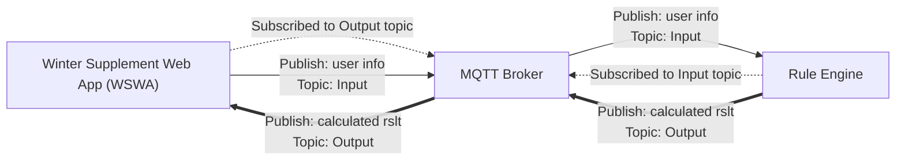

- [A Rules Engine with MQTT Broker and Winter Supplement Web App](#a-rules-engine-with-mqtt-broker-and-winter-supplement-web-app)
  - [Software Language](#software-language)
  - [System Overview](#system-overview)
  - [**Development Environment Set Up Instruction**](#development-environment-set-up-instruction)
  - [Run **the engine** directly using Docker](#run-the-engine-directly-using-docker)
    - [Get the source code](#get-the-source-code)
    - [Run the project](#run-the-project)
  - [More details](#more-details)
    - [The mock **WSWA**](#the-mock-wswa)
    - [Unit Test](#unit-test)


# A Rules Engine with MQTT Broker and Winter Supplement Web App

## Software Language

This project is written in Python. I use paho-mqtt as my MQTT Client.

## System Overview

The system structure is shown as follows.



This system consists of the **Winter Supplement Web App (WSWA)**, a **MQTT broker** and the **rules engine**, where the engine is my main develop content.
In the **WSWA**, users input their data, and click submit button.
**WSWA** works as a MQTT client and publishes this message of user input to the **MQTT broker**.
The topic prefix of this MQTT message is something like `BRE/calculateWinterSupplementInput/`.
**the engine** also works as a MQTT client and subscribes to this topic to receive this message.
After receiving the message, **the engine** processes the data based on the rules of winter supplement.
Then **the engine** publishes the calculated data to the topic with prefix like `BRE/calculateWinterSupplementOutput/`.
And the **WSWA** subscribes to this topic to get the calculated result.

> In order to develop **the engine** more conveniently, I made the mock version of the **WSWA**. The MQTT topics are different from the assignment-specified ones. Because the **MQTT broker** is the same to all developers, I don't want to mix my design with others. 

> In order to deploy and run the project more easily, both **the engine** and the mock **WSWA** run inside the Docker containers.

## **Development Environment Set Up Instruction**

1. install python3 on your machine
2. create a python virtual environment and activate it
   ```bash
   python3 -m venv <folder name>
   source <folder name>/bin/activate
   ``` 
3. get the source code
   ```bash
   cd <project folder>
   git clone https://github.com/feliciavan/mqtt.git
   ```
4. install the libs needed
   ```bash
   cd <project folder>/mqtt/dockerfiles/
   pip install -r requirements.txt
   ```
5. copy .env file to the proj folder
   
   This .env file contains self-specified MQTT topic prefixes, which are used to avoid to mix with the assignment-specified ones. You can change those prefixes to the assignment-specified ones. 
   ```bash
   cd <project folder>/mqtt
   cp .env proj/
   ```   
1. run the test and generate the html report of code coverage
   ```
      cd proj
      python -m coverage run -m unittest -v test.test_RuleEngine
      python -m coverage report
      python -m coverage html
   ```
2. open the coverage report
   
   go to `<project folder>/mqtt/proj/htmlcov`, open the `index.html` file with your browser. You will see the coverage report
3. run the **engine**
   ```bash
   cd <project folder>/mqtt/proj/
   python -m src.RuleEngine
   ```
   now, the **engine** will connect to the MQTT Broker, subscribe to all the input topics (the topics sharing the same prefix such as `xxxInput/`), and wait for any new message of those topics.
   Whenever it receive a new message from a topic such as `xxxInput/uuid`, it will calculate and publish the result to the topic named `xxxOutput/uuid` 
4. run the mock **WSWA**
   open a new terminal, activate the same virtual environment, and run:
   ```bash
   source <folder name>/bin/activate
   cd <project folder>/mqtt/proj/
   python -m src.webApp
   ```
   this mock **WSWA** will subscribe to all the output topics (the topics sharing the same prefix such as `xxxOutput/`) and publish new inputs to topic `xxxInput/someid` every 5 seconds.(9 inputs in total, covering different situations)
   Now you can switch back to the terminal that running the **engine**, you will see it starts do its job.
   You can see that the mock **WSWA** update the topic ID and the **engine** will do the calculation, and the mock **WSWA** will receive the calculation result.
   
 5.  **Update the MQTT topic ID to run the engine on a local machine**
 The mock **WSWA** is my way to update the MQTT topic ID to run the engine on a local machine.
 You can stop it and add more cases to the `mqtt/proj/src/webApp.py` script, and rerun it following step 10 to try your new case.


If you just want to check the result, you can run the engine following the section below.

## Run **the engine** directly using Docker

Firstly, you need to install the newest version of Docker in your environment. 

### Get the source code

```bash
git clone https://github.com/feliciavan/mqtt.git
```

### Run the project
Go to the folder where you keep the source code.
The content of this folder should be:
```
├── README.md
├── docker-compose.yml
├── dockerfiles
└── proj
```
docker-compose.yml uses .env.prod which contains the assginment-specified MQTT topic prefixes.

Then run this command:
```bash
docker compose up -d 
```
It will build the docker images needed, run the project, do the test, and generate the code coverage report.

Check the running components by `docker ps`.

The container named `RuleEngine` is my rules **engine**, and the container named `webapp` is the mock **WSWA**.


Now you can use `docker logs TestReport` to see the test result and test report.

You can also go to `proj/htmlcov`, and there you will find the html version of the testing coverage report there named `index.html`.
Open it with your browser to read it.

In `proj/log` you will find `engine.log` and `webapp.log`.
You can check them to see the running logs.
> You can also use `docker logs RuleEngine` and `docker logs webapp` to see the log.

> You can stop the **WSWA** using `docker rm -f webapp` after it emitting all its inputs.


## More details

###  The mock **WSWA**

The mock **WSWA** will publish 9 messages for 9 different cases, which are:

- Case 1: Not eligible
  - Topic: `MY/calculateWinterSupplementInput/topic-not-eligible`
  - Message:
    ```json
    {
      "id": "not-eligible",
      "numberOfChildren": 0,
      "familyComposition": "single",
      "familyUnitInPayForDecember": false
    }
    ```

- Case 2: Single with no children
  - Topic: `MY/calculateWinterSupplementInput/topic-single-no-children`
  - Message:
    ```json
    {
      "id": "single-no-children",
      "numberOfChildren": 0,
      "familyComposition": "single",
      "familyUnitInPayForDecember": true
    }
    ```

- Case 3: Couple with no children
  - Topic: `MY/calculateWinterSupplementInput/topic-couple-no-children`
  - Message:
    ```json
    {
      "id": "couple-no-children",
      "numberOfChildren": 0,
      "familyComposition": "couple",
      "familyUnitInPayForDecember": true
    }
    ```
  
- Case 4: Couple with children
  - Topic: `MY/calculateWinterSupplementInput/topic-couple-with-children`
  - Message:
    ```json
    {
      "id": "couple-with-children",
      "numberOfChildren": 2,
      "familyComposition": "couple",
      "familyUnitInPayForDecember": true
    }
    ```
  
- Case 5: Single with children
  - Topic: `MY/calculateWinterSupplementInput/topic-single-with-children`
  - Message:
    ```json
    {
      "id": "single-with-children",
      "numberOfChildren": 3,
      "familyComposition": "single",
      "familyUnitInPayForDecember": true
    }
    ```

- Case 6: Invalid topic ID
  - Topic: `MY/calculateWinterSupplementInput/`

- Case 7: Invalid payload
  - Topic: `MY/calculateWinterSupplementInput/topic-invalid-payload`
  - Message: `"123"`

- Case 8: Missing fields in input data
  - Topic: `MY/calculateWinterSupplementInput/topic-missing-fields`
  - Message:
    ```json
    {
      "id": "missing-fields",
      "numberOfChildren": 3,  
    }
    ```

- Case 9: Invalid input value
  - Topic: `MY/calculateWinterSupplementInput/topic-invalid-input-value`
  - Message:
    ```json
    {
      "id": "invalid-input-value",
      "numberOfChildren": 3,
      "familyComposition": "Christmas",
      "familyUnitInPayForDecember": true
    }
    ```

Here, I set the topic ID to be the specific case name for evident clarity in the logs.
I can also set the topic ID to be the random UUID.

### Unit Test
You can find the test code in `mqtt/proj/test/test_RuleEngine.py`

Basically, I test the `_onConnect` function and the `_onMessage` function.
For the `_onConnect` function, it is straightforward. It has two situations: connect successfully or fail.
For the `_onMessage` function, I provide it with 17 different inputs covering almost all the situations that can happen.
